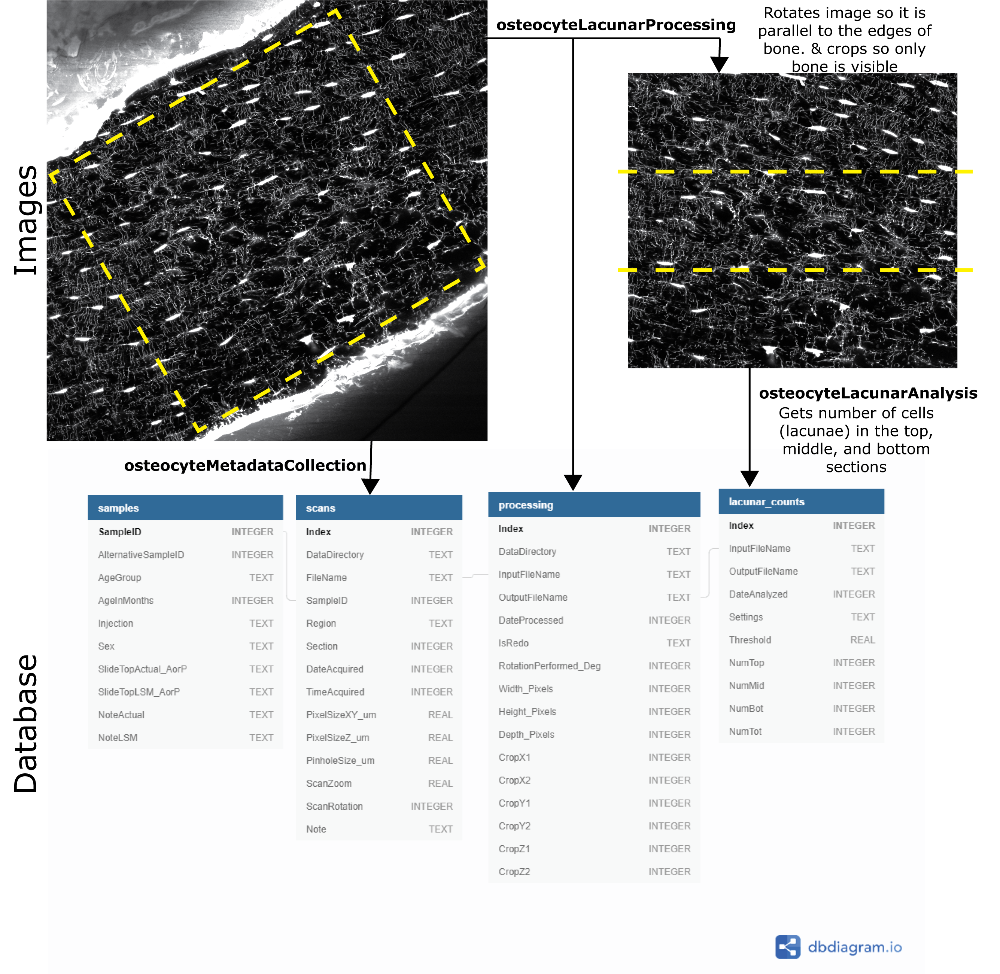
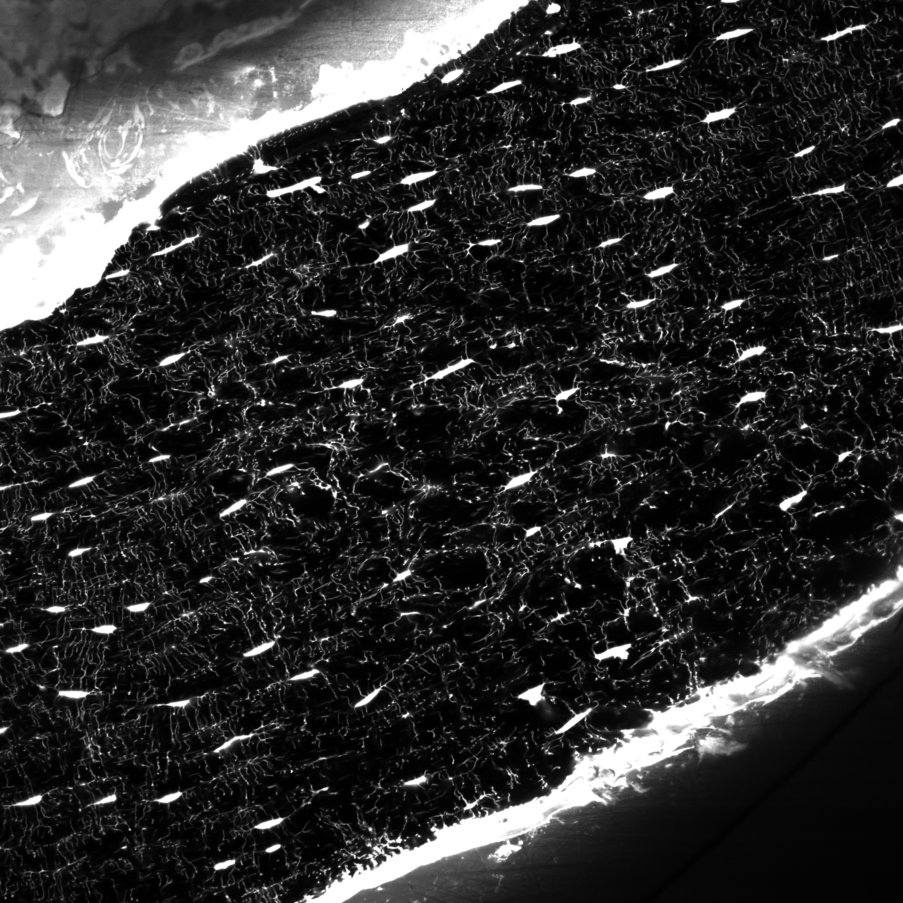

# Overview
`osteocyte` is a collection of functions and scripts to take image data of bone cells and output biologically meaningful data to a database for statistical analysis. The basic process is:

## Procedure
Once new bone image data in .czi format are acquired the procedure is:
1. Run the script `osteocyteMetadataCollection`, which will collect metadata on .czi files and output it to the database for later use.
    * When prompted give:
        1. the directory to deposit a copy of the *scans* metadata  table, 
        1. the location of the osteocyte.db file, and 
        1. the new .czi file(s).
    * The script will then check if pre-existing data on the .czi file exists, and if not, will add a new observation to the *scans* table with its metadata. 
    * The script also outputs a copy of the new *scans* table in .csv format to the user prompted directory (see a). 
    * Script dependencies:
        * toolboxes:
        * functions:

1. Run the script `osteocyteLacunarProcessing`, which asks for user prompted rotations and cropping. The goal is to get a square volume parallel to the edges of the bone, and which only includes bone. Outputs processed .tif stack(s) and the processing data to the database.
    * When prompted give:
        1. the directory to output a copy of the *processing* table and .tif stacks, 
        1. the location of the osteocyte.db file, and
        1. the .czi file(s) to process.
    * The script will check if processing has been performed previously, and if not, as the user to rotate and crop the volume. It puts this data in the *processing* table and outputs:
        * a .tif stack(s) of processed volume(s) in the given directory
        * a copy of the *processing* table.
    * Script dependencies:
        * toolboxes:
        * functions:
        
1. Run the script `osteocyteLacunarAnalysis`, which takes processed .tif stack(s) and figures out how many cells (lacunae) are in the top, middle, and bottom thirds of the volume. Outputs these counts to the database.
    * When prompted give:
        1. the directory to output a copy of the *lacunar_counts* table,
        1. the location of the osteocyte.db file, and
        1. the processed .tif file(s) to process.
    * The script will find all the cells in the volume, eliminate any that are touching the edges of the volume, and figure out how many cells are in the top, middle, and bottom thids of the volume. It puts this data in the *lacunar_counts* table and also outputs a copy of the *lacunar_counts* table to the user given directory. 
    * Script dependencies:
        * toolboxes:
        * functions:

## Images
Images come from thin slices cut from bones which are fluorescently labeled with a red dye and then imaged using a microscope. The code was written for Zeiss-branded microscopes, which produce files in the .czi format. These files can be read using the [Bio-Formats open software](https://www.openmicroscopy.org/bio-formats/). A sample image is shown below. These typically are taken as stacks of images to visualize a volume.

